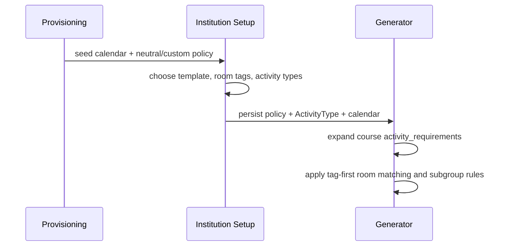

# TABLESYS Universal Scheduling Architecture Blueprint

## Purpose
TABLESYS now moves toward a scheduling-primitives architecture instead of a hardcoded engineering-only academic model. The core idea is:

`activity -> audience -> duration -> frequency -> constraints -> resources`

Institutions define their own activity vocabulary, room capability tags, and policy defaults. The scheduler remains neutral.

## Canonical Precedence Rules
1. `Course.activity_requirements` is the primary source of schedulable session units.
2. If `activity_requirements` is absent, the generator derives legacy activities from:
   - `lecture_hours`
   - `tutorial_hours`
   - `practical_hours`
3. `ActivityType` fills missing defaults for:
   - display name
   - duration
   - frequency
   - subgroup requirement
   - room tags
4. `University.scheduling_policy` supplies institution-wide defaults when course-level frequency is absent.
5. Room matching is tag-first:
   - if an activity requires tags, the room must include all required tags
   - otherwise the legacy `preferred_room_type` flow applies
6. Subgroup resolution is activity-driven:
   - `StudentGroup.custom_subtype` is preferred
   - legacy `group_type` is fallback

## Fallback Chain
1. `Course.activity_requirements` is read first.
2. If a requirement omits duration, frequency, subgroup behavior, or room tags, the generator fills them from tenant `ActivityType`.
3. If the course uses legacy hour fields instead, the generator derives `lecture`, `tutorial`, and `practical` session descriptors from those fields.
4. If an activity has no required room tags, room selection falls back to legacy room-type matching.
5. If a subgroup-required activity finds no matching subgroup rows, generation falls back to the base cohort so scheduling can still continue.
6. If a course references an unknown `activity_type_key`, course create/update is rejected at the API boundary. Institution Setup remains the authoritative place to define new keys.

## Hybrid Room Matching
- Tag-based suitability is the canonical path.
- Legacy `preferred_room_type` remains a compatibility fallback for existing tenants and for any activity with no required tags.
- This means a room can still be scheduled even if the tenant has not fully migrated its room catalog to tags, but coordinators should treat tags as the long-term truth.

## Compatibility Model
- Legacy data remains valid.
- Existing engineering-style tenants can continue generating timetables without migration.
- New tenants can define custom activity vocabularies through setup.
- Activity metadata is additive; legacy timetable slot storage continues using `session_type` for compatibility.

## Data Flow
1. Tenant provisioning seeds:
   - default calendar
   - default scheduling policy
   - a neutral `custom` template unless a specific institution template is known
2. Coordinator opens Institution Setup.
3. Setup writes:
   - default academic calendar values
   - scheduling policy
   - room tag catalog
   - activity type configuration
4. Course setup can begin storing `activity_requirements`.
5. Generator expands activities into concrete session units and schedules them using the institution-defined vocabulary.

## Current Implementation Notes
- `ActivityType` is tenant-scoped.
- `Room.tags` enables capability-based matching.
- `StudentGroup.custom_subtype` unlocks institution-specific subgroup semantics.
- `University.onboarding_completed_at` marks the institution setup flow as completed.
